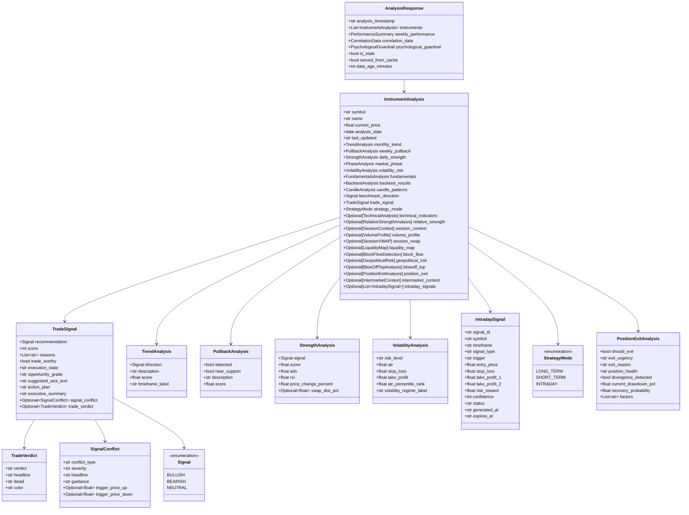
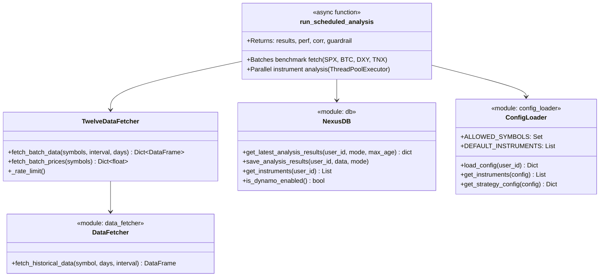
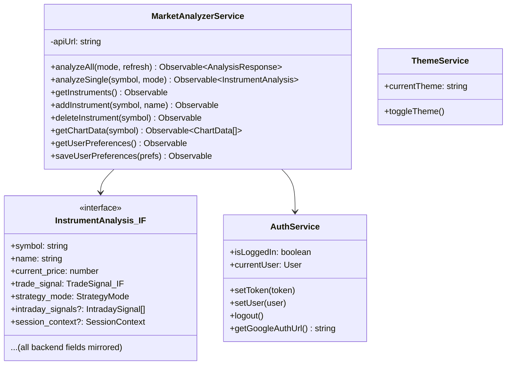
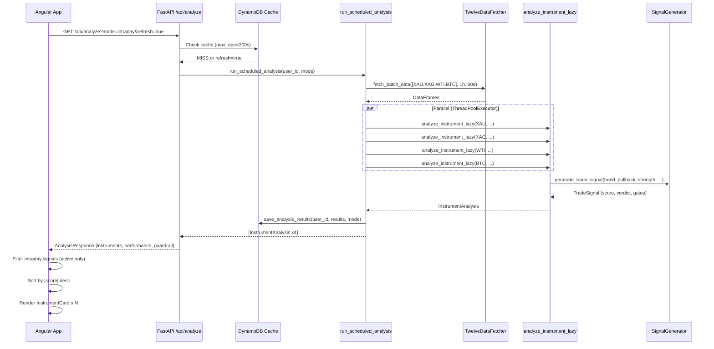
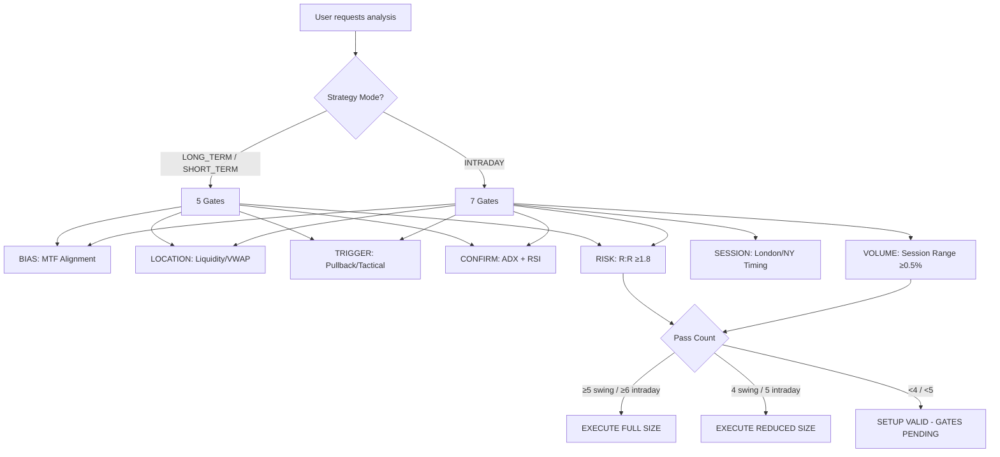

# Market Analyser AI — Class Diagram

## System Architecture Overview

```
┌─────────────────────────────────────────────────────────────────────────────┐
│  BROWSER (Angular 17 SPA)          │  AWS LAMBDA (FastAPI Backend)          │
│                                    │                                         │
│  App → Components → Services  ──── REST API ───▶  Analyzers → Models        │
│                                    │                     ▼                   │
│                                    │              TwelveData / yFinance       │
│                                    │              DynamoDB / S3               │
└─────────────────────────────────────────────────────────────────────────────┘
```

---

## 1. Backend Domain Models (`backend/app/models.py`)



---

## 2. Backend Analyzer Pipeline (`backend/app/analyzers/`)

```mermaid
classDiagram
    direction LR

    class analyze_instrument_lazy {
        <<function>>
        +symbol: str
        +mode: StrategyMode
        +Returns: InstrumentAnalysis
    }

    class TrendAnalyzer {
        <<module: trend_analyzer>>
        +analyze_monthly_trend(df) TrendAnalysis
    }

    class PullbackAnalyzer {
        <<module: pullback_analyzer>>
        +analyze_weekly_pullback(df) PullbackAnalysis
    }

    class StrengthAnalyzer {
        <<module: strength_analyzer>>
        +analyze_daily_strength(df) StrengthAnalysis
    }

    class VolatilityAnalyzer {
        <<module: volatility_analyzer>>
        +analyze_volatility_and_risk(df) VolatilityAnalysis
        +calculate_atr(df) float
    }

    class SignalGenerator {
        <<module: signal_generator>>
        +generate_trade_signal(...) TradeSignal
        +_detect_signal_conflict(...) SignalConflict
        +_derive_execution_profile(...) tuple
        +compute_composite_score(...) CompositeResult
        +apply_all_hard_filters(...) tuple
    }

    class IntradaySignalGenerator {
        <<module: intraday_signal_generator>>
        +detect_intraday_signals_verbose(...) List~IntradaySignal~
        +detect_ema_cross(df) signal
        +detect_macd_cross(df) signal
        +detect_confluence(df) signal
    }

    class TechnicalAnalyzer {
        <<module: technical_analyzer>>
        +analyze_technical_indicators(df) TechnicalAnalysis
        +analyze_session_context(df) SessionContext
    }

    class BacktestEngine {
        <<module: backtest_engine>>
        +get_backtest_results(sym, df) BacktestAnalysis
        +sharpe_ratio: float
        +max_drawdown_pct: float
        +expectancy: float
    }

    class PositionExitAnalyzer {
        <<module: position_exit_analyzer>>
        +analyze_position_exit(analysis) PositionExitAnalysis
    }

    class VolumeProfileAnalyzer {
        <<module: volume_profile_analyzer>>
        +analyze_volume_profile(df, mode) VolumeProfile
        +POC: float
        +VAH: float
        +VAL: float
    }

    class LiquidityMapAnalyzer {
        <<module: liquidity_map_analyzer>>
        +analyze_liquidity_map(df) LiquidityMap
        +resistance_levels: List
        +support_levels: List
    }

    class BlockFlowAnalyzer {
        <<module: block_flow_analyzer>>
        +analyze_block_flow(df) BlockFlowDetection
    }

    class DayTradingExpert {
        <<module: day_trading_expert>>
        +build_expert_trade_plan(...) Dict
        +detect_opening_range(df) ORBData
        +calculate_rvol(df) float
    }

    analyze_instrument_lazy --> TrendAnalyzer
    analyze_instrument_lazy --> PullbackAnalyzer
    analyze_instrument_lazy --> StrengthAnalyzer
    analyze_instrument_lazy --> VolatilityAnalyzer
    analyze_instrument_lazy --> SignalGenerator
    analyze_instrument_lazy --> IntradaySignalGenerator
    analyze_instrument_lazy --> TechnicalAnalyzer
    analyze_instrument_lazy --> BacktestEngine
    analyze_instrument_lazy --> PositionExitAnalyzer
    analyze_instrument_lazy --> VolumeProfileAnalyzer
    analyze_instrument_lazy --> LiquidityMapAnalyzer
    analyze_instrument_lazy --> BlockFlowAnalyzer
    analyze_instrument_lazy --> DayTradingExpert
```



---

## 3. Backend Data Layer



---

## 4. Backend API Layer (`backend/app/main.py`)

```mermaid
classDiagram
    direction TB

    class FastAPIApp {
        <<FastAPI>>
        +GET /api/analyze → AnalysisResponse
        +GET /api/analyze/{symbol} → InstrumentAnalysis
        +GET /api/instruments
        +POST /api/instruments
        +DELETE /api/instruments/{symbol}
        +GET /api/signals
        +POST /api/signals/refresh
    }

    class AuthMiddleware {
        <<module: auth>>
        +get_current_user(token) user_id
        +verify_jwt(token) Claims
    }

    class OAuthRouter {
        <<module: oauth>>
        +GET /api/auth/login → redirect to Google
        +GET /api/auth/callback → JWT token
        +POST /api/auth/local/login
    }

    class ChatRouter {
        <<module: chat_routes>>
        +POST /api/chat → ChatResponse
        +AI Copilot: OpenAI integration
    }

    class GeopoliticalRouter {
        <<module: geopolitical_routes>>
        +GET /api/geo/sentiment → GeopoliticalResponse
        +GET /api/geo/crisis-alerts
    }

    FastAPIApp --> AuthMiddleware
    FastAPIApp --> OAuthRouter
    FastAPIApp --> ChatRouter
    FastAPIApp --> GeopoliticalRouter
    FastAPIApp --> run_scheduled_analysis
```

---

## 5. Frontend Services (`frontend/src/app/services/`)



---

## 6. Frontend Component Tree

```mermaid
classDiagram
    direction TB

    class AppComponent {
        +instruments: Signal~InstrumentAnalysis[]~
        +strategyMode: Signal~StrategyMode~
        +selectedInstrument: Signal~InstrumentAnalysis~
        +loading: Signal~boolean~
        +runAnalysis(silent, refresh)
        +toggleStrategyMode()
        +switchStrategyMode(mode)
    }

    class InstrumentCardComponent {
        +analysis: InstrumentAnalysis
        +getExecBiasStatus() YES|NO|COUNTERTREND
        +getExecLocationStatus() YES|NO
        +getExecTriggerStatus() YES|NO
        +getExecConfirmationStatus() YES|WEAK|NO
        +getExecRiskStatus() YES|NO
        +getExecSessionStatus() YES|WEAK|NO [intraday]
        +getExecVolumeStatus() YES|NO [intraday]
        +getExecPassCount() number
        +getExecDecision() label+cssClass
        +getActiveIntradaySignals() IntradaySignal[]
        +formatPrice(v) string
    }

    class OpportunitiesOverviewComponent {
        +instruments: InstrumentAnalysis[]
        +strategyMode: string
        +filtered() InstrumentAnalysis[]
        +direction(inst) string
        +modeChange: EventEmitter
    }

    class WatchlistHeatmapComponent {
        +instruments: InstrumentAnalysis[]
        +getHeatClass(inst) string
        +getGateCount(inst) number
    }

    class OrbDashboardComponent {
        +orbInstruments: Signal~ORBPlan[]~
        +bullCount() number
        +bearCount() number
    }

    class SettingsComponent {
        +onClose: EventEmitter
        +onUpdated: EventEmitter
    }

    class StrategySettingsComponent {
        +onClose: EventEmitter
        +onUpdated: EventEmitter
    }

    class AiCopilotComponent {
        +selectedInstrument: InstrumentAnalysis
        +sendMessage(text)
    }

    class TradeJournalComponent {
        +logTrade(analysis)
    }

    class SmartAlertsComponent {
        +alerts: Alert[]
    }

    AppComponent --> InstrumentCardComponent
    AppComponent --> OpportunitiesOverviewComponent
    AppComponent --> WatchlistHeatmapComponent
    AppComponent --> OrbDashboardComponent
    AppComponent --> SettingsComponent
    AppComponent --> StrategySettingsComponent
    AppComponent --> AiCopilotComponent
    AppComponent --> TradeJournalComponent
    AppComponent --> SmartAlertsComponent
    InstrumentCardComponent --> InstrumentChartComponent
    InstrumentCardComponent --> MultiTimeframeOverlayComponent
```



---

## 7. End-to-End Request Flow



---

## 8. Execution Gate Logic (Intraday vs Swing)


